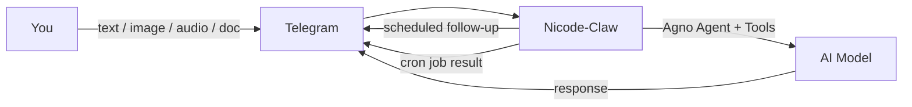
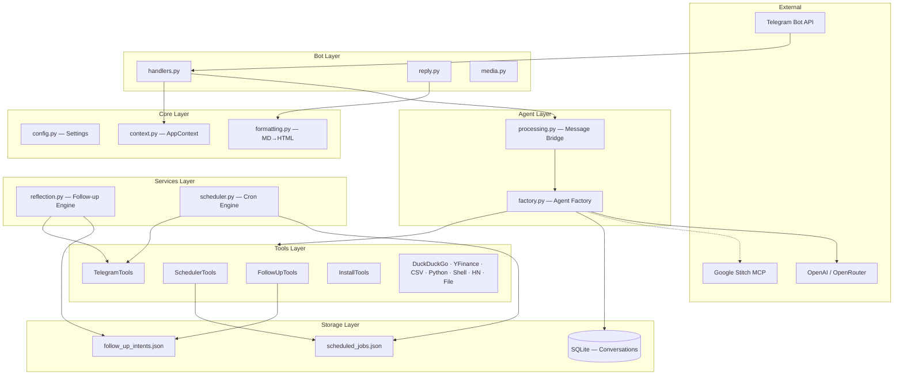
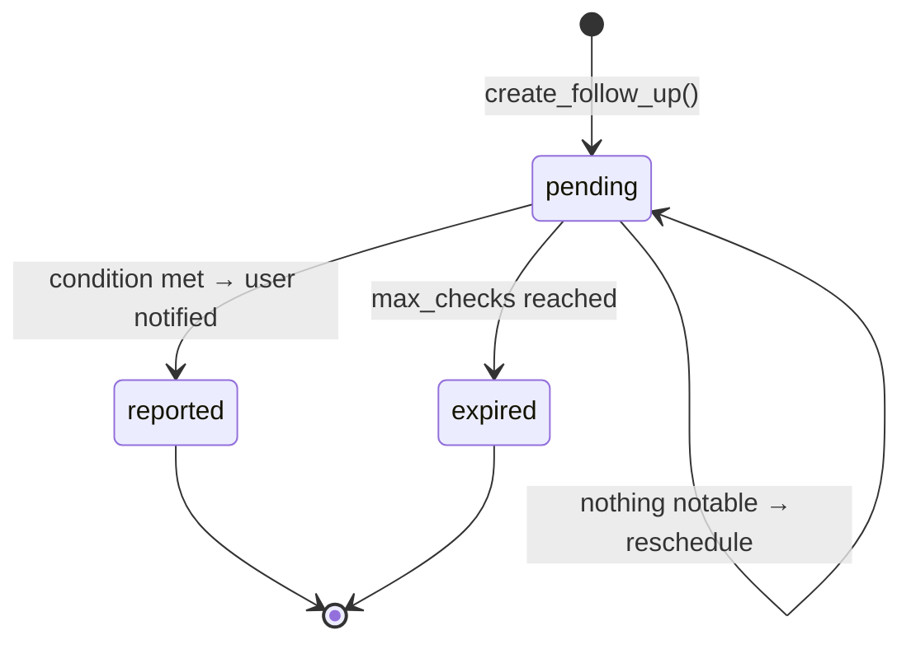
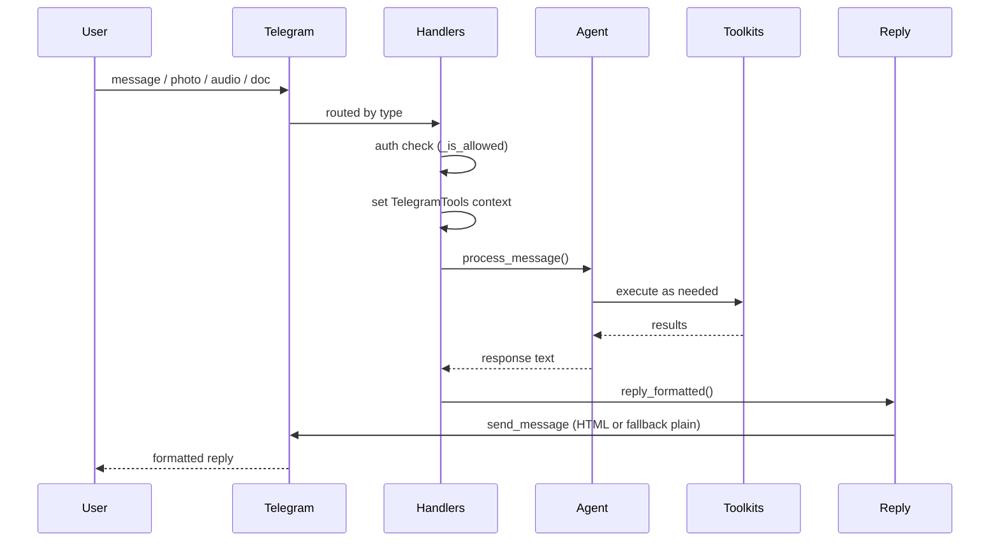

<h1 align="center">Nicode-Claw</h1>

<p align="center">
  <strong>A proactive AI assistant that lives in your Telegram</strong>
</p>

<p align="center">
  Multimodal conversations &middot; Follow-up intents &middot; Cron jobs &middot; MCP integration
</p>

---

## The Problem

Chat-based AI assistants are reactive: they answer when you ask, then go silent. Real productivity requires an assistant that remembers what matters, checks on things proactively, and reaches out when something needs your attention.

## The Solution

Nicode-Claw is a Telegram bot powered by an Agno AI agent that combines **reactive conversation** with **proactive intelligence**. It processes text, images, documents, and audio on demand — and autonomously follows up on tasks, monitors conditions, and reports back when something is worth your time.



---

## Key Features

| Feature | Description |
|---------|-------------|
| **Multimodal input** | Text, photos (vision), documents, audio/voice (Whisper transcription) |
| **Proactive follow-ups** | Agent creates intents to check back on topics automatically |
| **Cron jobs** | Schedule recurring tasks with standard cron expressions |
| **Quiet hours** | No proactive messages during configurable night hours |
| **Rate limiting** | Caps proactive messages per hour to prevent spam |
| **12+ toolkits** | Web search, finance, CSV, Python, shell, file I/O, and more |
| **MCP support** | Optional Google Stitch integration via Model Context Protocol |
| **Dual mode** | Polling for development, webhook for production |
| **Access control** | Restrict bot to specific Telegram user IDs |
| **Auto-install** | Agent installs missing Python packages at runtime via `uv` |

---

## Architecture



### Layer Responsibilities

| Layer | Directory | Role |
|-------|-----------|------|
| **Core** | `src/nicode_claw/core/` | Configuration (`Settings`), dependency container (`AppContext`), formatting |
| **Storage** | `src/nicode_claw/storage/` | JSON persistence for jobs and intents; SQLite via Agno for conversation memory |
| **Tools** | `src/nicode_claw/tools/` | Agent-callable toolkits: follow-up, scheduler, telegram, install |
| **Services** | `src/nicode_claw/services/` | Background loops: reflection engine and cron scheduler |
| **Agent** | `src/nicode_claw/agent/` | Agent factory and message-processing bridge |
| **Bot** | `src/nicode_claw/bot/` | Telegram handlers, reply formatting, media download |

---

## Quick Start

### Prerequisites

- **Python 3.12+**
- **[uv](https://docs.astral.sh/uv/)** — fast Python package manager
- **Telegram Bot Token** — from [@BotFather](https://t.me/BotFather)
- **OpenAI API Key** — from [platform.openai.com](https://platform.openai.com) (or OpenRouter)

### Install and Run

```bash
# 1. Clone the repository
git clone <repo-url> nicode-claw && cd nicode-claw

# 2. Install dependencies
make install

# 3. Configure environment
cp .env.example .env
# Edit .env — at minimum set TELEGRAM_BOT_TOKEN and OPENAI_API_KEY

# 4. Start the bot
make run
```

That's it. Open Telegram, find your bot, and send a message.

### Verify It's Working

Send `/start` to your bot in Telegram. You should see:

> Ciao! Sono il tuo assistente AI. Inviami un messaggio, un'immagine o un audio e ti rispondo.

---

## Configuration

All configuration is managed through environment variables (`.env` file). Copy `.env.example` and adjust:

### Required

| Variable | Description |
|----------|-------------|
| `TELEGRAM_BOT_TOKEN` | Bot token from @BotFather |
| `OPENAI_API_KEY` | OpenAI API key (required even if using OpenRouter) |

### Model Selection

| Variable | Default | Description |
|----------|---------|-------------|
| `MODEL_PROVIDER` | `openai` | `openai` or `openrouter` |
| `MODEL_ID` | `gpt-5.4` | Model identifier (e.g. `openai/gpt-5.4` for OpenRouter) |
| `OPENROUTER_API_KEY` | — | Required when `MODEL_PROVIDER=openrouter` |

### Bot Behavior

| Variable | Default | Description |
|----------|---------|-------------|
| `MODE` | `polling` | `polling` (dev) or `webhook` (prod) |
| `WEBHOOK_URL` | — | Public HTTPS URL for webhook mode |
| `ALLOWED_USER_IDS` | — | Comma-separated Telegram user IDs; empty = open to all |
| `DB_PATH` | `data/nicode_claw.db` | SQLite database path for conversation history |

### Proactive Intelligence

| Variable | Default | Description |
|----------|---------|-------------|
| `QUIET_HOURS_START` | `23` | Hour (0–23) when proactive messages stop |
| `QUIET_HOURS_END` | `7` | Hour (0–23) when proactive messages resume |
| `MAX_PROACTIVE_MESSAGES_PER_HOUR` | `5` | Rate limit for proactive follow-up messages |
| `REFLECTION_INTERVAL_MINUTES` | `15` | How often the reflection loop checks for due intents |

### Integrations

| Variable | Default | Description |
|----------|---------|-------------|
| `GOOGLE_STITCH_API_KEY` | — | Enables Google Stitch MCP server |

---

## Usage

### Conversations

Send any text message and the agent responds using its full toolset — web search, code execution, finance data, and more.

```
You: What's the current price of AAPL?
Bot: AAPL is currently trading at $213.07, up 1.2% today.
```

### Images

Send a photo with an optional caption. The agent uses vision capabilities to analyze it.

```
You: [sends photo of a chart] What does this chart show?
Bot: This is a candlestick chart showing AAPL stock price over the last 30 days...
```

### Documents

Send any text document. The bot extracts and processes the content.

```
You: [sends CSV file] Summarize this data
Bot: The dataset contains 1,247 rows of sales data spanning Jan–Mar 2026...
```

### Audio / Voice

Send a voice message or audio file. The bot transcribes it with Whisper and processes the transcription.

```
You: [sends voice message]
Bot: 🎙 Trascrizione:
     Remind me to check the quarterly report tomorrow morning
     I'll set a follow-up to check the quarterly report tomorrow at 9 AM.
```

### Follow-Up Intents

The agent proactively creates follow-ups when conversations involve trackable topics. You can also request them explicitly:

```
You: Watch AAPL and let me know if it drops below $200
Bot: Follow-up created (ID: a3f7b2c1): will check 'AAPL below $200' at 2026-04-08 10:30
```

The reflection engine checks periodically. If the condition is met, you get a proactive message:

> ⚡ Heads up — AAPL dropped to $197.42, below your $200 threshold.

If nothing changed, the bot stays silent and reschedules automatically.

**Intent lifecycle:**



**Check-in time formats** (parsed by `storage/intents.py:25`):

| Input | Meaning |
|-------|---------|
| `30m`, `1h`, `2d`, `1w` | Relative time from now |
| `tomorrow`, `tomorrow morning` | Next day at 09:00 |
| `tonight` | Today at 20:00 |
| `next week` | 7 days from now |

### Scheduled Jobs (Cron)

Ask the agent to create recurring tasks:

```
You: Send me a daily summary of top Hacker News stories at 9 AM
Bot: Job 'Daily HN Summary' created with ID g8k2m9n3. Schedule: 0 9 * * *
```

**Cron expression format:** `minute hour day_of_month month day_of_week`

| Expression | Schedule |
|------------|----------|
| `0 9 * * *` | Every day at 09:00 |
| `0 8 * * 1-5` | Weekdays at 08:00 |
| `*/30 * * * *` | Every 30 minutes |
| `0 9,15,21 * * *` | At 09:00, 15:00, and 21:00 |

### File Generation

When the agent creates files (charts, CSVs, reports), it sends them directly to you in Telegram:

```
You: Plot the last 30 days of AAPL closing prices
Bot: [sends image of the chart]
     Here's the 30-day chart for AAPL.
```

### Runtime Package Installation

If a package is missing, the agent installs it automatically:

```
You: Analyze this Excel file
Bot: Package 'openpyxl' installed successfully.
     The spreadsheet contains 3 sheets with...
```

---

## How It Works

### Message Processing Flow



### Reflection Engine

The reflection loop (`services/reflection.py`) runs every `REFLECTION_INTERVAL_MINUTES`:

1. Skip if inside quiet hours
2. Load due intents from `data/follow_up_intents.json`
3. Sort by priority (high → medium → low)
4. For each intent (respecting rate limit):
   - Ask the agent to evaluate whether the condition is met
   - Parse `VERDICT: YES` → extract message, send to user
   - Parse `VERDICT: NO` → reschedule or expire
5. Prune intents that exceeded `max_checks`

### Cron Scheduler

The scheduler (`services/scheduler.py`) checks every 60 seconds:

1. Load jobs from `data/scheduled_jobs.json`
2. Match current time against each job's cron expression
3. Execute matched jobs through the agent
4. Send results to the user via Telegram

---

## Available Toolkits

The agent has access to these tools at runtime (configured in `agent/factory.py:59`):

| Toolkit | Source | Capabilities |
|---------|--------|-------------|
| **DuckDuckGoTools** | Agno | Web search |
| **HackerNewsTools** | Agno | Tech news aggregation |
| **YFinanceTools** | Agno | Stock quotes and financial data |
| **CsvTools** | Agno | CSV file manipulation |
| **FileTools** | Agno | File read/write (`tmp/files/`) |
| **PythonTools** | Agno | Python code execution (`tmp/python/`) |
| **ShellTools** | Agno | Shell command execution |
| **FollowUpTools** | Custom | Create, list, delete follow-up intents |
| **SchedulerTools** | Custom | Create, list, delete cron jobs |
| **TelegramTools** | Custom | Send files and images to user |
| **InstallTools** | Custom | Install Python packages via `uv` |
| **MCPTools** | Agno | Google Stitch integration (optional) |

### Adding a Custom Tool

Create a new toolkit in `src/nicode_claw/tools/` by extending Agno's `Toolkit`:

```python
# src/nicode_claw/tools/my_tool.py
from agno.tools.toolkit import Toolkit


class MyTool(Toolkit):
    def __init__(self):
        super().__init__(name="my_tool")
        self.register(self.my_function)

    def my_function(self, query: str) -> str:
        """Describe what this does — the agent reads this docstring.

        Args:
            query: What the agent passes in.

        Returns:
            What the agent receives back.
        """
        return f"Result for: {query}"
```

Then register it in `agent/factory.py` — add it to the `tools` list in `create_agent()`.

---

## Deployment

### Polling Mode (Development)

Default. No additional configuration needed.

```bash
make run
```

### Webhook Mode (Production)

Set in `.env`:

```env
MODE=webhook
WEBHOOK_URL=https://your-domain.com/webhook
```

The bot listens on `0.0.0.0:8443` (`main.py:90`). You need a reverse proxy (nginx, Caddy) in front with a valid TLS certificate.

### Data Persistence

The `data/` directory contains all runtime state:

| File | Purpose |
|------|---------|
| `nicode_claw.db` | SQLite database — conversation history and agent memory |
| `scheduled_jobs.json` | Cron job definitions |
| `follow_up_intents.json` | Follow-up intent tracking |

This directory is git-ignored. Back it up for production deployments.

---

## Development

### Setup

```bash
make install
```

### Project Structure

```
src/nicode_claw/
├── __main__.py          # Entry point: python -m nicode_claw
├── main.py              # Bootstrap: settings, tools, agent, bot, services
├── core/
│   ├── config.py        # Settings dataclass from env vars
│   ├── context.py       # AppContext dependency container
│   └── formatting.py    # Markdown → Telegram HTML converter
├── storage/
│   ├── intents.py       # Follow-up intents CRUD + time parsing
│   └── jobs.py          # Scheduled jobs CRUD
├── tools/
│   ├── follow_up.py     # FollowUpTools toolkit
│   ├── scheduler.py     # SchedulerTools toolkit
│   ├── telegram.py      # TelegramTools — file sending
│   └── install.py       # InstallTools — runtime uv add
├── services/
│   ├── reflection.py    # ReflectionRunner + loop
│   └── scheduler.py     # Cron scheduler + cron_matches()
├── agent/
│   ├── factory.py       # Agent creation + model selection
│   └── processing.py    # Message processing + Whisper transcription
└── bot/
    ├── handlers.py      # Telegram update handlers
    ├── reply.py         # Formatted reply with HTML fallback
    └── media.py         # File download from Telegram
```

### Running

```bash
make run
# or directly:
uv run python -m nicode_claw
```

### Clean

```bash
make clean    # Removes tmp/, data/, __pycache__, .pytest_cache
```

### Code Conventions

- Python 3.12+ with `from __future__ import annotations` in every module
- Type hints on all function signatures
- `TYPE_CHECKING` blocks for imports that would cause circular dependencies
- Immutable `Settings` via `frozen=True` dataclass
- `AppContext` as a single dependency-injection container
- Toolkits extend `agno.tools.toolkit.Toolkit` and self-register with `self.register()`
- Storage functions are plain JSON load/save — no ORM for jobs and intents
- Logging via standard `logging` module; no print statements

---

## Agent Skills

Nicode-Claw loads skills from `.agents/skills/` at startup via Agno's `LocalSkills` loader. Installed skills include:

| Skill | Source | Description |
|-------|--------|-------------|
| `pdf` | anthropics/skills | PDF processing |
| `docx` | anthropics/skills | Word document manipulation |
| `pptx` | anthropics/skills | PowerPoint generation |
| `xlsx` | anthropics/skills | Excel spreadsheet operations |
| `design-md` | google-labs-code/stitch-skills | Design from Markdown |
| `enhance-prompt` | google-labs-code/stitch-skills | Prompt enhancement |
| `remotion` | google-labs-code/stitch-skills | Video generation |
| `shadcn-ui` | google-labs-code/stitch-skills | UI component generation |
| `stitch-design` | google-labs-code/stitch-skills | Design iteration |
| `stitch-loop` | google-labs-code/stitch-skills | Design loop refinement |
| `taste-design` | google-labs-code/stitch-skills | Taste-based design |

---

## Troubleshooting

| Issue | Cause | Fix |
|-------|-------|-----|
| `ValueError: TELEGRAM_BOT_TOKEN and OPENAI_API_KEY must be set` | Missing env vars | Set both in `.env` |
| Bot doesn't respond to messages | Wrong `ALLOWED_USER_IDS` | Add your Telegram user ID, or leave empty for open access |
| No proactive follow-ups | Quiet hours active | Check `QUIET_HOURS_START`/`END` — defaults to 23–7 |
| `uv not found in PATH` | uv not installed | Install: `curl -LsSf https://astral.sh/uv/install.sh \| sh` |
| Webhook not receiving updates | TLS / URL mismatch | Ensure `WEBHOOK_URL` is HTTPS and points to port 8443 |
| Files not sent to user | Path not found | Agent-generated files go to `tmp/files/` or `tmp/python/` — `TelegramTools` searches these automatically |

---

## Rationales

### Why Agno?

Agno provides a batteries-included agent framework with built-in toolkits, SQLite memory, MCP support, and skill loading. It removes boilerplate for tool registration, conversation persistence, and model switching — letting this project focus on the proactive intelligence layer.

### Why JSON files for jobs and intents?

Jobs and intents are small, low-throughput datasets that change infrequently. JSON files are human-readable, easy to debug, and require zero infrastructure. If scale becomes a concern, the storage layer (`storage/jobs.py`, `storage/intents.py`) can be swapped for a database without touching the rest of the codebase.

### Why a reflection loop instead of a task queue?

The reflection loop is simple, predictable, and runs in-process. For a single-user assistant, a full task queue (Celery, Redis) adds operational complexity with no benefit. The loop's quiet hours and rate limiting provide sufficient guardrails.

### Why `uv` for runtime installs?

`uv` is the same package manager used for project dependencies. Using it for runtime installs ensures consistent resolution and avoids conflicts with the existing dependency tree.

---

## Quality Checklist

- [ ] All environment variables documented with defaults
- [ ] File references match actual source paths
- [ ] Code examples use correct API signatures
- [ ] Architecture diagram reflects current implementation
- [ ] Cron expression examples are valid
- [ ] Quick start steps are reproducible from a clean clone
- [ ] No secrets or tokens in README
- [ ] Troubleshooting covers common setup errors

---

## Roadmap

- [ ] Test suite (pytest + pytest-asyncio)
- [ ] CI/CD pipeline (GitHub Actions)
- [ ] Linting and formatting config (ruff, black)
- [ ] Docker containerization
- [ ] PostgreSQL storage backend for multi-user scale
- [ ] Web dashboard for managing jobs and intents
- [ ] Structured output parsing for reflection verdicts (replace string matching)
- [ ] Input validation and path sanitization in `TelegramTools.send_file()`
- [ ] Async file I/O with `aiofiles` in storage layer
- [ ] Health check endpoint for production monitoring

---

## License

This project is proprietary software. All rights reserved.

---

## Acknowledgments

- [Agno](https://github.com/agno-agi/agno) — AI agent framework
- [python-telegram-bot](https://github.com/python-telegram-bot/python-telegram-bot) — Telegram Bot API wrapper
- [OpenAI](https://openai.com/) — GPT models and Whisper transcription
- [uv](https://docs.astral.sh/uv/) — Python package manager by Astral
